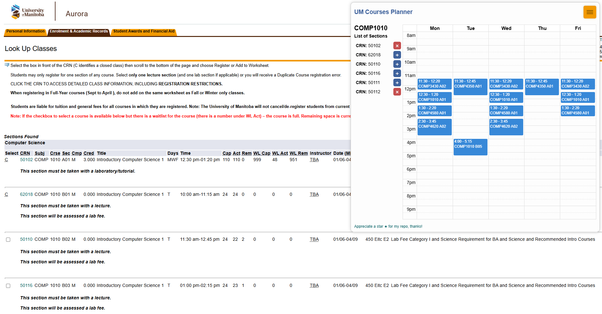

# UM Course Planner - Web Extension

## Overview

UM Courses Planner is a Chrome/Edge web extension designed to streamline the process of planning and visualizing University of Manitoba course schedules. The extension extracts course information from the Aurora Student portal and automatically populates a weekly calendar, helping students organize their schedules more efficiently.

## How It Works
1. Sidebar Interface: The extension adds a sidebar to Aurora's course selection pages. The sidebar contains an add course button `+` and a list of selected courses. Users can collapse and expand the sidebar for a cleaner interface.

2. Course Scanning: When visiting a page that lists course sections (containing 'Sections Found'), the extension scans the table and extracts the necessary details (CRN, subject, course code, days, times, and dates).

3. Add Course to Calendar: Once a course is added via the add course button `+`, it is stored in the addedCourses array and displayed on the calendar. The calendar uses FullCalendar.js to visualize your weekly schedule.

4. Session Persistence: The selected courses are saved in sessionStorage, allowing users to switch between Aurora pages without losing their schedule.

## Installation

1. Clone the repository:

```bash
git clone https://github.com/nateng98/UM-Course-Planner.git
```
2. Load the extension in Chrome/Edge:

- Go to `chrome://extensions/` in Chrome, or `edge://extensions/` in Edge
- Enable "Developer mode"
- Click "Load unpacked" and select the folder where the extension was cloned.

3. Start using the extension:

- Go to aurora course list and start planning!

## Screenshots



## Technologies Used
- JavaScript: For main logic and DOM manipulation.
- Chrome API: For browser extension functionalities.
- FullCalendar.js: To provide a rich calendar interface.

## Contributing
Feel free to submit a pull request if you have any suggestions or would like to contribute! You can also open an issue to report bugs or request new features.

## Contact
For any questions or feedback, reach out to me at [nathan.ng.0808@gmail.com](mailto:nathan.ng.0808@gmail.com).